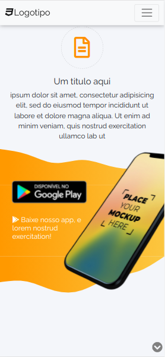
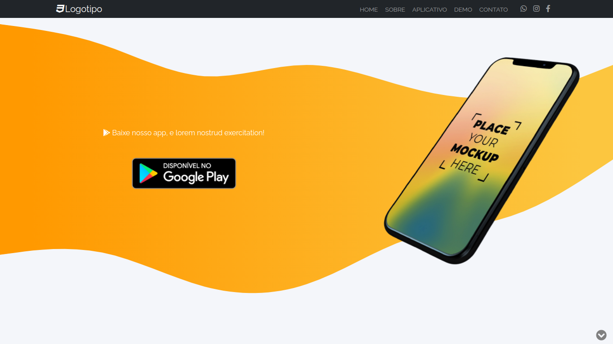

<style>
    .center {
        text-align: center;
    }
    #mobile-container-images {
        width: 100%;
        display: flex;
        flex-direction: row;
        justify-content: center;
        flex-wrap: wrap;
    }
    #mobile-container-images > img {
        margin-right: 20px;
        margin-bottom: 20px;
    }

</style>
<p id="logo" class="center">
    
</p>

------------------------------------

## Índice

* [Sobre](#sobre)
* [Funcionalidades](#funcionalidades)
* [Layout](#layout)
* [Como Executar](#como-executar)
* [Tecnologias](#tecnologias)
* [Autor](#autor)
* [Licença](#licenca)
* <a href="https://saulo-felipe.github.io/Futebol-One-Page/" target="_blank">⚽ Banca para Apostas ---- Concluído ✅ ----</a>

------------------------------------

## 💻 Sobre <a id="sobre"></a>
 
 ⚽ Website modelo <a href="https://www.google.com/search?q=one+page&rlz=1CATVZD_enBR952&oq=one+page&aqs=chrome..69i57j0i512l2j46i512j0i512j69i60l3.3028j0j7&sourceid=chrome&ie=UTF-8">One page<a>
<a href="https://saulo-felipe.github.io/Futebol-One-Page/" id="title"></a> seguindo a temática de uma <em>"banca de apostas de futebol"</em> com design e uma estrutura totalmente responsiva.
<br>

------------------------------------

## ⚙️ Funcionalidades <a id="funcionalidades"></a>
1. ✅ Responsividade
2. ✅ Design e animações
3. ✅ Estrutura compatível com diferentes tipos de tema
4. ✅ Construído em HTML5 (Semântico)
    * Permite ser facilmente encontrado em ferramentas de buscas como o Google.
5. ✅ Facilmente editável

------------------------------------

## 🎨 Layout <a id="layout"></a>

<a href="https://saulo-felipe.github.io/Futebol-One-Page/">
<svg xmlns="http://www.w3.org/2000/svg" xmlns:xlink="http://www.w3.org/1999/xlink" width="190" height="20" role="img" aria-label="Acesso ao Layout: Github Pages"><title>Acesso ao Layout: Github Pages</title><linearGradient id="s" x2="0" y2="100%"><stop offset="0" stop-color="#bbb" stop-opacity=".1"/><stop offset="1" stop-opacity=".1"/></linearGradient><clipPath id="r"><rect width="190" height="20" rx="3" fill="#fff"/></clipPath><g clip-path="url(#r)"><rect width="107" height="20" fill="#555"/><rect x="107" width="83" height="20" fill="#007ec6"/><rect width="190" height="20" fill="url(#s)"/></g><g fill="#fff" text-anchor="middle" font-family="Verdana,Geneva,DejaVu Sans,sans-serif" text-rendering="geometricPrecision" font-size="110"><text aria-hidden="true" x="545" y="150" fill="#010101" fill-opacity=".3" transform="scale(.1)" textLength="970">Acesso ao Layout</text><text x="545" y="140" transform="scale(.1)" fill="#fff" textLength="970">Acesso ao Layout</text><text aria-hidden="true" x="1475" y="150" fill="#010101" fill-opacity=".3" transform="scale(.1)" textLength="730">Github Pages</text><text x="1475" y="140" transform="scale(.1)" fill="#fff" textLength="730">Github Pages</text></g></svg>
</a>
<p>*O Layout completo do site está disponível no Github Pages</p>

<h2>Mobile (web)</h2>
<div id="mobile-container-images">
    
    
</div>

<h2>Desktop (web)</h2>



------------------------------------

## 🧩 Como Executar <a id="como-executar"></a>

A execução é bem simples, sem a necessidade de instalação de nenhum programa externo (exceto o git que já deve estar instalado no seu PC). Basta seguir o passo a passo:

```
# Clone o repositório
$ git clone https://github.com/Saulo-Felipe/Futebol-One-Page.git

# Em seguida, abra a pasta baixada no seu explorador de arquivos e clique duas vezes sobre o 'index.html'.
```

------------------------------------

## 🤖 Tecnologias <a id="tecnologias"></a>

Neste simples site, foram utilizado as seguintes tcnologias: 

* Bootstrap <svg xmlns="http://www.w3.org/2000/svg" viewBox="0 0 128 128" width="16px"><path fill="#5B4282" d="M75.701 65.603c-2.334-.768-5.694-.603-10.08-.603h-17.621v23h18.844c2.944 0 5.012-.315 6.203-.535 2.099-.376 3.854-1.104 5.264-1.982 1.409-.876 2.568-2.205 3.478-3.881.908-1.676 1.363-3.637 1.363-5.83 0-2.568-.658-4.54-1.975-6.436-1.316-1.896-3.141-2.965-5.476-3.733zM73.282 55.087c2.317-.688 4.064-1.89 5.239-3.487 1.176-1.598 1.763-3.631 1.763-6.044 0-2.286-.549-4.314-1.646-6.054s-2.662-2.413-4.699-3.056c-2.037-.641-5.53-.446-10.48-.446h-15.459v20h16.587c4.042 0 6.939-.38 8.695-.913zM126 18.625c0-9.182-7.443-16.625-16.625-16.625h-91.75c-9.182 0-16.625 7.443-16.625 16.625v91.75c0 9.182 7.443 16.625 16.625 16.625h91.75c9.182 0 16.625-7.443 16.625-16.625v-91.75zm-35.447 66.12c-1.362 2.773-3.047 4.911-5.052 6.415-2.006 1.504-4.521 2.78-7.544 3.548-3.022.769-6.728 1.292-11.113 1.292h-27.844v-69h27.42c5.264 0 9.485.609 12.665 2.002 3.181 1.395 5.671 3.497 7.474 6.395 1.801 2.898 2.702 5.907 2.702 9.071 0 2.945-.8 5.708-2.397 8.308-1.598 2.602-4.011 4.694-7.237 6.292 4.166 1.222 7.37 3.304 9.61 6.248 2.24 2.945 3.36 6.422 3.36 10.432 0 3.227-.681 6.225-2.044 8.997z"/></svg> 

* HTML5 </img>
* CSS3 </img>
* Javascript </img>
* FontAewsome </img>
* Google Fonts </img>

------------------------------------

## 👨 Autor <a id="autor"></a>

<div class="center">➡️ Criado e desenvolvido por <strong>eu</strong> mesmo 🧑‍💻.</div>

------------------------------------

## 📜 Licença <a id="licenca"></a>

Todos os direitos reservados ©Copyright - Saulo Felipe